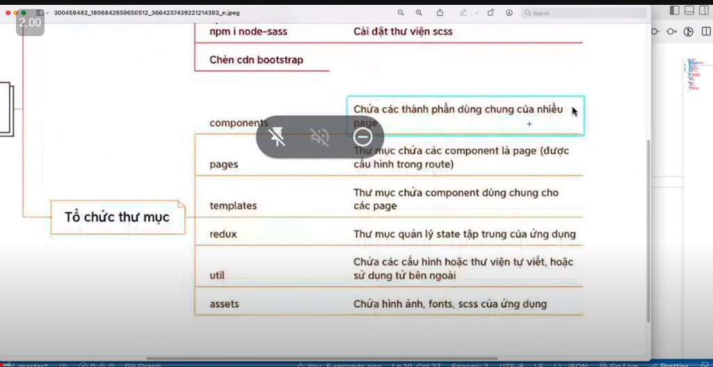

# Basic-ReactJS
Học FE cơ bản
## nguồn tham khảo
[Link youtobe Here](https://www.youtube.com/watch?v=qe6xXyMEIEY&list=PLikSVTWMZtjNUFFsvZJpiaNpR1_hrggDf&index=8&ab_channel=L%C3%AATh%C3%A0nhPh%E1%BA%A1m)

## Note 
### Buoi 10
    Note: 
    - học hook (UseState -- UseEffect -- ...)
    -  cai lib
    - tao component

## lệnh cơ bản

    tạo project: npx create-react-app demo-reactjs 
    run project: npm start 
    cai lại thư viện node_modules: npm i

    lib bootstrap - scss:   npm i sass-loader 
                            npm i node-sass
        npm rebuild --force
        npm audit fix --force
    npm i react-router-dom      -- chú ý <Outlet /> - App.js
    npm i axios                 -- goi APi
    npm i redux                 -- redux
    npm i react-redux           -- redux
    npm i @reduxjs/toolkit
    chen bootstrap -- fa5-css -- fontawesome

    npm build

    npm  i react-use            -- hook custom
    npm i react-spring          -- animation
    npm install formik --save   -- lib giúp quản lý form
    npm install yup --save      -- lib - regex || validationSchema
    npm i history               -- quanr ly router (add lib History  của router giup chuyển trang khi k đứng ở component)

###
    tao nhanh jsx: 
    rfc: react function component
    rcc: react class component
    rcredux: react class component redux
    rxreducer: reducer 

### hook - rfc: react function component

    - useState:
    - useEffect:
    - useCallback - dùng để tối ưu các render
    - useMemo: useConnect-tối ưu về biến || hoặc có thể khai báo ở ngoài
    -useRef : giống useState nhưng nó sẽ lưu lại sau mỗi lần render - phuf hợp vs conponent Login
    - useParams() -- nhan data truyen theo router
    - useSearchParams() - dung de nhan data co cac keyword dac biet theo router

#### Link fake img 
    - avatar : https://i.pravatar.cc/?u=${age}
    - img random : https://picsum.photos/id/2/200/200
    - API: https://svcy.myclass.vn/swagger/ui/indexs
    - link Api Shoes Shop : 
            - https://shop.cyberlearn.vn/api/Product
            - https://shop.cyberlearn.vn/swagger/index.html

#### boostrap 

    <!-- Bootstrap CSS v5.2.1 -->
     <link href="https://cdn.jsdelivr.net/npm/bootstrap@5.2.1/dist/css/bootstrap.min.css" rel="stylesheet"
    integrity="sha384-iYQeCzEYFbKjA/T2uDLTpkwGzCiq6soy8tYaI1GyVh/UjpbCx/TYkiZhlZB6+fzT" crossorigin="anonymous">
    
    <!-- Bootstrap JavaScript Libraries -->
    

    

    the lien kết các trang lại vs nhau Nav-link  react router dom

    fa5- fontawesom
### middleware redux toolkit
#### viblo.asia

### lib cho form login

* [Link formik ](https://formik.org/) Build forms in React, without the tears 
    
    
