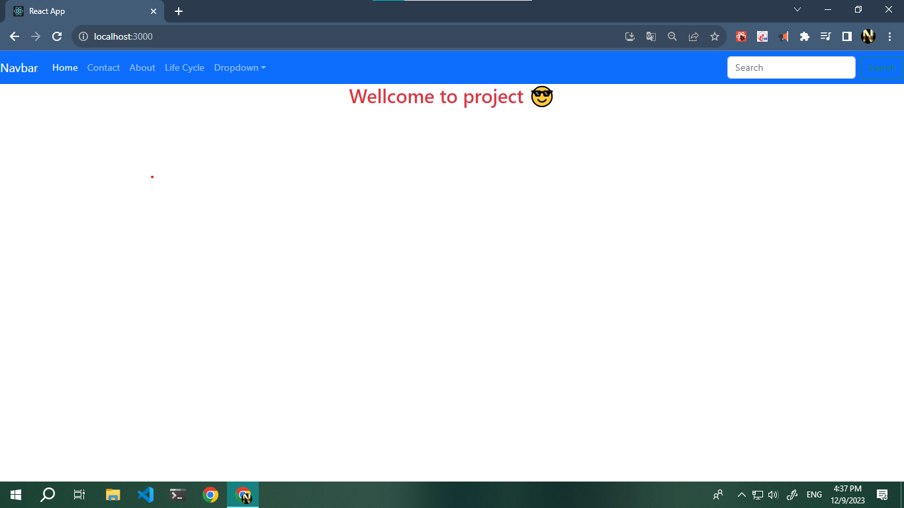
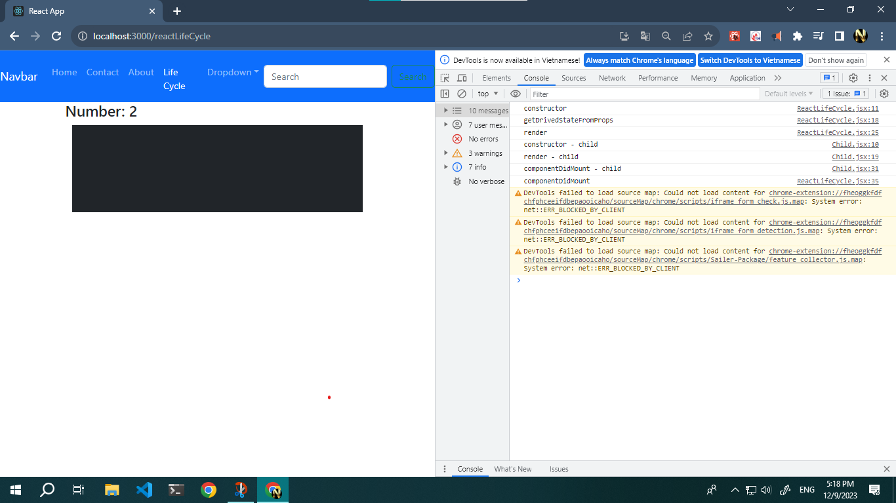

# Demo buoi 6 Life Cycle -- axios
    lifecycle: 
        + Mouting: Các hàn sẽ tự kích hoạt khi sử dụng một component. dùng để can thiệp vào quá trình trước khi render hoặc sau khi render ( componentDidMount() ) nhằm mục đích xử lý  state và props
        + can thiệp thay đổi state trước khi render() -- sử dụng static getDerivedStateFromProps(newProps, currentState) {}
        + Can thiếp thay đổi state sau khi render() --- sử dụng ComponentDidMount() {}
        + ComponentDidMount() chỉ chạy một lần duy nhất khi component losd lần đầu tiên - thường dùng để  call api
        + getDerivedStateFromProps() chạy sau mỗi lần reload()
        + shouldComponentUpdate(newProps, currentState) {} -- tra về True || false -- chạy sau getDerivedStateFromProps() và trước render() - Nếu nó không thực thi, điều đó có nghĩa là không có props hay state nào được thay đổi.
        + trường hợp shouldComponentUpdate() phải sử dụng nhiều if-else để kiểm soát thì react có extend PureComponent để hỗ trợ
        + PureComponent là một component không co lifecycle shouldComponentUpdate()  tuy nhiên PureComponent đã hỗ trợ việc sử lý render khi co props thay đổi và không render() khi prop không thay đổi
        + lưu ý : 
            -so sánh ở đây chỉ là  dang shallow compare - nhận biết được (primitime value): number, String, boolean, undefined,...
            - đồi với reference  value thì khi cập nhật state ở component cha  phải sử dụng {...spreadOperator}

## Anh my home

## ảnh lifecycle
