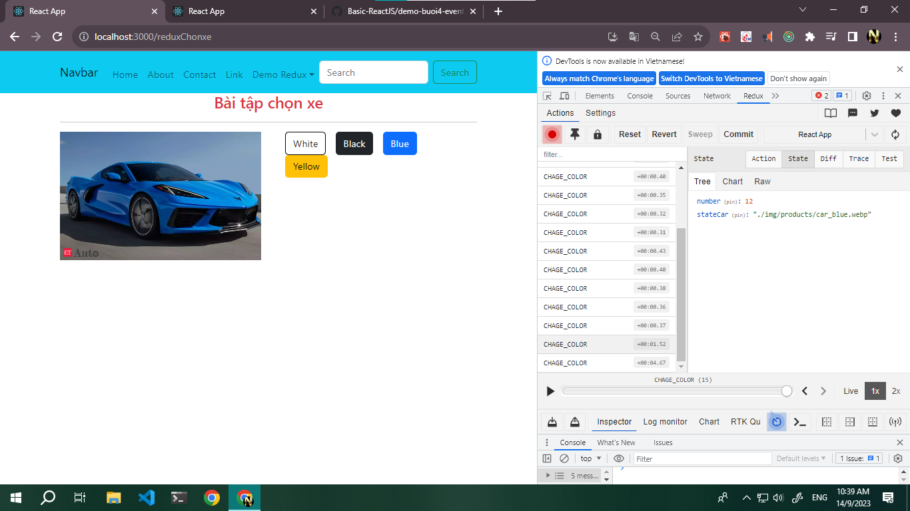

# buổi 8 học redux

    lib
        npm i redux
        npm i react-redux
        npm i react-router-dom   -- chú ý <Outlet /> - App.js

    nội dung: 
        cài redux
        cài router
        configStore 
            export const store = createStore(rootReducer, window.__REDUX_DEVTOOLS_EXTENSION__ && window.__REDUX_DEVTOOLS_EXTENSION__());
            lấy từ git cua redux-devtool () (https://github.com/reduxjs/redux-devtools -> Documentation -> Browser Extension Installation and Configuration ->  Basic store )
    

## ảnh minh họa

## ảnh bài tập chọn xe
