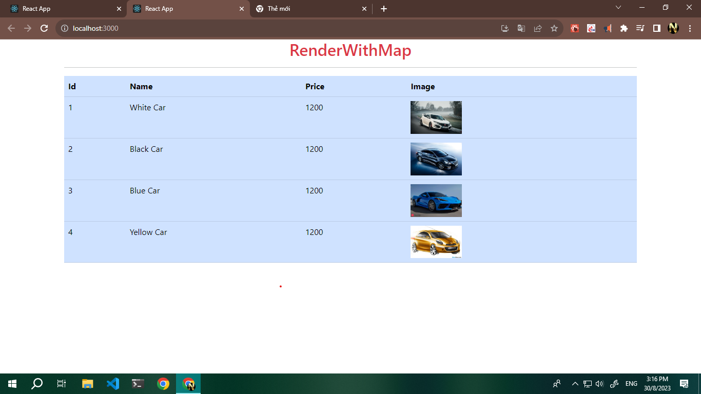
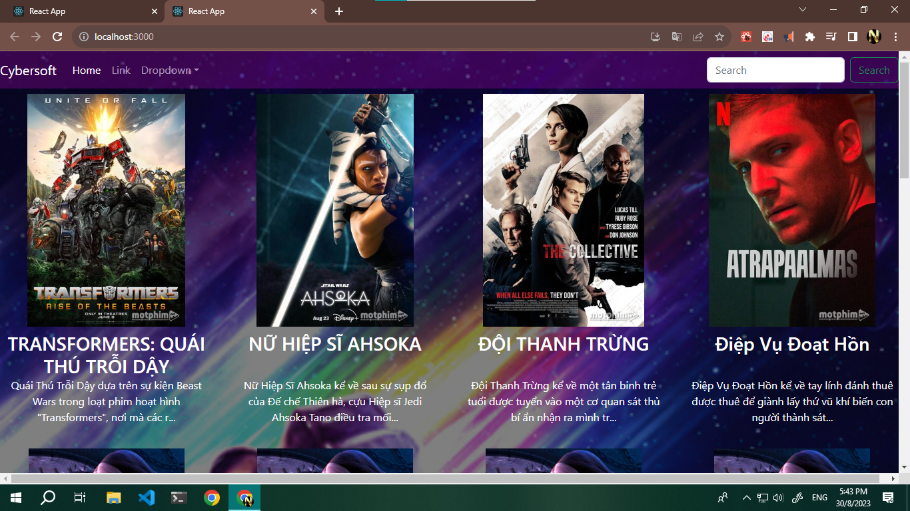

# Học react buoi 3 --- Render
    
### lenh dac biet 
     

        <h3 style={{height:60 }}>{item.tenPhim}</h3>
        
{item.moTa.length>100 ? item.moTa.slice(0,100)+ '...' : item.moTa }

    

### render product

### render film
