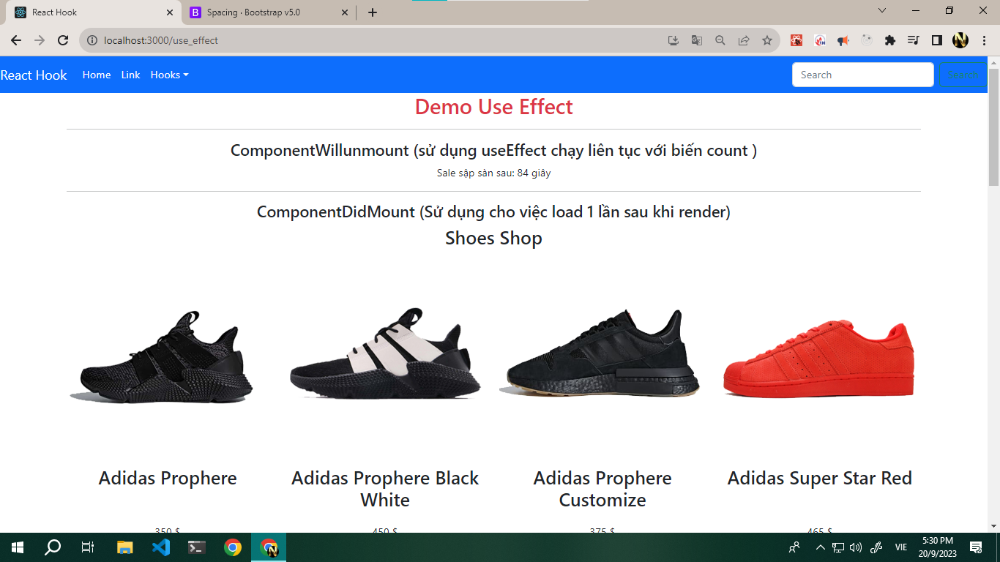

# REACT BUOI 10 học Hook

## Note
    - Cài thư viện: 
    - tao component 
    - su dung router
    - BT use State
    -- hoc UseEffectDemo
    - memo(react) giúp găn render khi khong su dung
    - fix lỗi khi memo trong khi chuyền function qua các các component thì các fun dó sẽ dược làm mới dấn đến sẽ render các component không dùng -> fix bằng hàm useCallback(fun, [bien_thay_doi])
    - link Api Shoes Shop : https://shop.cyberlearn.vn/api/Product

## Anh minh hoa

### Anh UseEffectDemo

### Anh UseEffectDemo
    - useMemo: useConnect-tối ưu về biến trong khi componentA co 1 biến gửi đi sang B (dgl bien_x)thi mỗi lần render thi sẽ lại tạo ra một bien_x và render lại componentB  sử dụng usememo sẽ làm cản chở việc đó. 

