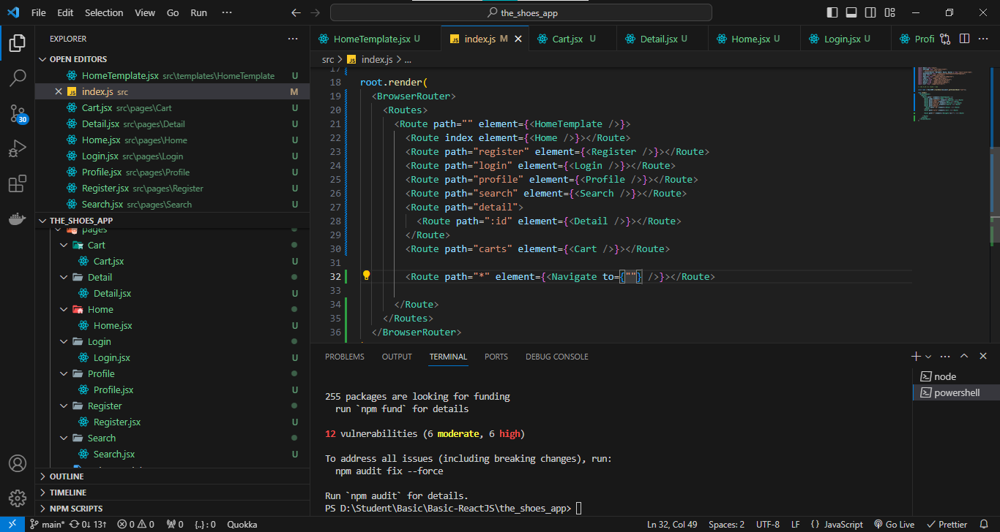
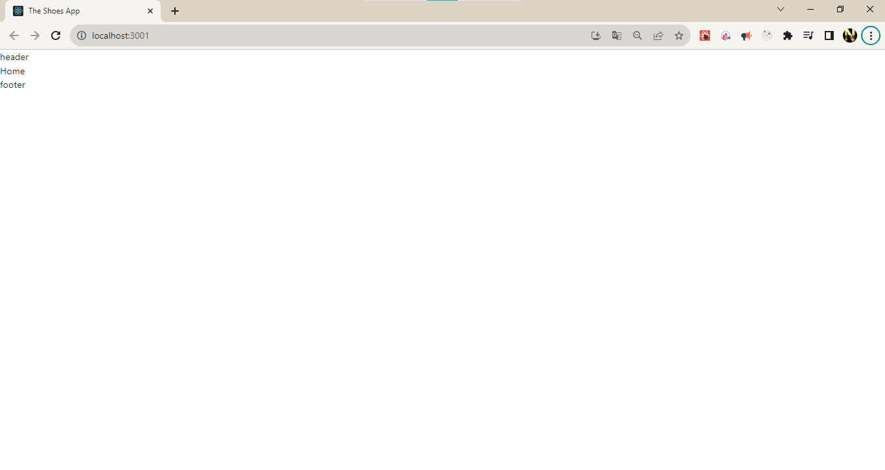
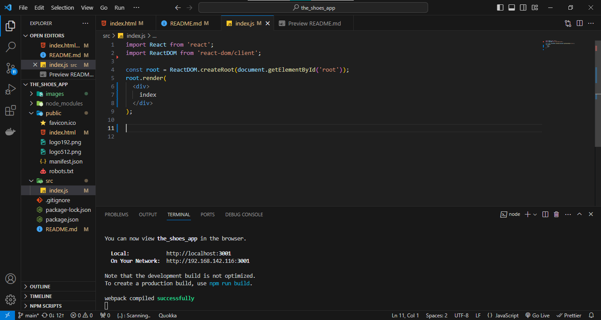

# BT Shop Shoes - gook luck

Tgian thực hiên ()

## bước thực hiện

    - tạo dự án
        npx create-react-app the_shoes_app
    - boostrap 5 
        bs5-$ (extensions VS Code)
    - del file khong su dung ở src (để lai mỗi index.js)
    - lib scss:
        npm i node-sass 
        npm i sass-loader
            npm rebuild --force                 -- err scss
            npm audit fix --force               -- err scss
    - lib cal Api:
        npm i axios
    - lib  loại bỏ những rắc rối khi làm việc với mảng, số, đối tượng, chuỗi, v.v
        npm i lodash
    - lib router:
        npm i react-router-dom                  -- chú ý <Outlet /> - App.js
    - lib redux
        npm i redux
        npm i react-redux
        npm i @reduxjs/toolkit
    -
    -
    -
    -
    -
    -
    -
    - 

## Note
    - npm build

    - lib khac: 
        npm  i react-use            -- hook custom
        npm i react-spring          -- animation
        npm install formik --save   -- lib giúp quản lý form
        npm install yup --save      -- lib - regex || validationSchema
        npm i history               -- quanr ly router (add lib History  của router giup chuyển trang khi k đứng ở component)

## Ảnh minh họa

## nguồn tham khảo - tài liệu
*   [link youtube](https://www.youtube.com/watch?v=8FIFV-fg3-o&list=PLikSVTWMZtjNUFFsvZJpiaNpR1_hrggDf&index=16&ab_channel=L%C3%AATh%C3%A0nhPh%E1%BA%A1m)
*   [link figma](https://www.figma.com/file/HPyvaEJpBCxXB3p2r59nk6/Capstone-project-full-page?type=design&node-id=5704-693&mode=design&t=QT1HLvdabEVGzjI7-0)
*   [link APi](https://shop.cyberlearn.vn/swagger/index.html)
*   [link Search icon fa](https://glyphsearch.com/) theo thẻ i-class
